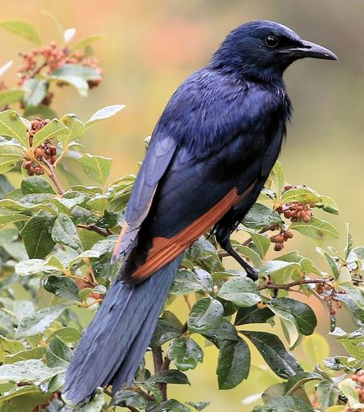

<br>

# Purpose of this document:


This document is to allow anyone to see the location of **Red-Winged Starling** (_Onychognathus morio_) nests containing chicks at the University of Cape Town (UCT) Upper Campus in 2019 and 2021 on an interactive map. Data have been collected and kindly provided by Dr Susan Cunningham.

<br>

# Context:
Covid caused a lockdown at UCT starting March 2020 until near the end of 2021. The sudden drop in human traffic and closing of cafeterias during this time meant that the starlings lost access to a major food resource, as they are often seen scavenging anthropogenic food around students, kiosks and in rubbish bins (du Plessis, 2005). Starling breeding season occurs in summer: In this time pairs prospect potential nest sites, build nests, lay eggs, and provide for their hatched chicks. Chick ringing and observation typically takes place in the beginning of the year, therefore 2021 data represents a during-covid period, and 2019 represents a pre-covid period. 

The changes associated with lockdown could impact starling reproductive success and nest location in two ways:

1. Sudden low food availability resulted in decreased provisioning for starling chicks and decline in starling breeding success and population. Fewer nests will be observed in 2021 compared to 2019.
2. The loss of readily-available junk food forced adult starlings to search for more natural, healthier alternatives to provide for chicks (eg. insects and fruit), resulting in greater chick fitness. More nests will be observed in 2021 than in 2019.

<br>
```{r whatisGIS, echo=FALSE, fig.cap = "", fig.width=3, fig.align = 'center', fig.cap = "An adult Red-Winged Starling."}

```
<br>

## Packages required

```{r, warning=F, message=F}
library(sf)
library(ggspatial)
library(rosm)
library(leaflet)
library(htmltools)
```
<br>

## Read in data
```{r datasets, warning=F, message=F}
dat <- st_read("./Data/SHP/GISDataset-point.shp") #read in .shp file
```
```{r be, echo = F, warning=F, message=F}
dat$Mass = NULL #remove unrelated variables 
```
<br>

## Tidying: Subsetting data into 2 timeframes
1. 2019 Data
```{r, warning=F, message=F}
split_dat_2019 = c("2019")  #pre covid data
dat2019 <- dat[which(dat$Year %in% split_dat_2019),]

```
2. 2021 Data
```{r, warning=F, message=F}
split_dat_2021 = c("2021")  #during covid data
dat2021 <- dat[which(dat$Year %in% split_dat_2021),]

```
```{r fdf, echo = F, warning=F, message=F}
dat2021 = dat2021[!duplicated(dat2021$NestID),] #remove dupliactes 2021 #remove unrelated variables 
dat2019 = dat2019[!duplicated(dat2019$NestID),] #remove dupliactes 2019
```
<br>

## Interactive map:
```{r}
leaflet() %>%
  addTiles(group = "Default") %>%  
  addCircleMarkers(data = dat2019,
                   group = "Year",
                   radius = 4, 
                   color = "blue") %>%
  addCircleMarkers(data = dat2021,
                 group = "Year",
                 radius = 2, 
                 color = "red")
```
**Figure 1.** _Interactive map showing starling nests that were observed with chicks at UCT Upper Campus in 2019 (red), 2021 (blue), and nests used in both (blue with inner red dot)._  
<br>

## Discussion:
There were 20 observed nests in 2021, and 15 nests in 2019. Of these 6 nests are reused. 

Reused nests indicate that they are well-placed, protected from rain, wind and predators. These nests appear to be evenly-dispersed across campus with no apparent tendency.

There are generally fewer nests North of campus than there are South. North campus may be less favourable for nesting due to the noise and activity from the construction of Chris Hani building during covid. 

There is a high density of nests around Sarah Baartman Hall, which is close to the lunch eating areas. This could suggest that ease of access to anthropocentric food is a factor considered when choosing a nest. Starlings at UCT have shown to have flexibility in not being dependent on anthropogenic food, however this is only confirmed for the non-breeding season, so this may not be this case during breeding season when there is increased pressure to forage (Stofberg et al., 2019). Additionally, while high-calorie junk food has been shown to benefit adult starlings, it is nutrient-insufficient for their chicks and is detrimental to their growth (Catto et al., 2021). Therefore it is possible that the lack of junk food during lockdown lead to an increase in chick fitness and may be responsible for the greater number of nests in 2021 than 2019.

<br>

## Constraints:
* Since data are limited only to nests that were observed with chicks, there are likely many nests missed due to being out of sight or out of reach by ladder.
* At this point of time, 2022 data cannot be used as the year has not completed, however future studies could incorporate this as an additional marker on the map. 


## References
* Catto, S., Sumasgutner, P., Amar, A., Thomson, R. and Cunningham, S., 2021. Pulses of anthropogenic food availability appear to benefit parents, but compromise nestling growth in urban red-winged starlings. Oecologia, 197(3), pp.565-576.
* du Plessis M (2005) Red-winged starlings that breed in the urban environment. Promerops 263:16
* Stofberg, M., Cunningham, S., Sumasgutner, P. and Amar, A., 2019. Juggling a “junk-food” diet: responses of an urban bird to fluctuating anthropogenic-food availability. Urban Ecosystems, 22(6), pp.1019-1026.
